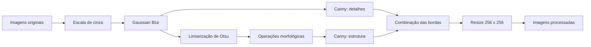

# Pipeline de Pré-processamento de Imagens de Peças Metálicas

Mini-projeto avaliativo do Módulo 2 de Machine Learning e Visão Computacional.

## Sobre o projeto

Este projeto implementa um pipeline em Python e OpenCV para processar, em lote, imagens de peças metálicas fundidas. Seu objetivo é transformar imagens brutas em representações padronizadas que evidenciem contornos, ranhuras e possíveis falhas estruturais.

O sistema não classifica as peças como defeituosas ou não defeituosas. O resultado produzido serve como preparação para uma etapa futura, na qual as imagens poderão ser utilizadas no treinamento de um modelo de Machine Learning.

## Fluxo de processamento



O pipeline combina as bordas encontradas na imagem suavizada com as bordas da máscara refinada. Dessa forma, o resultado preserva detalhes internos e reforça o contorno principal da peça.

## Dataset

Foi utilizado o conjunto público [Casting Product Image Data for Quality Inspection](https://drive.google.com/file/d/1K5gNxQ7RXA-nb4boNzPYQTJlRvJyYBD1/view?usp=sharing), disponibilizado no enunciado do projeto.

O conjunto contém 1.300 imagens em escala de cinza, originalmente com resolução de `512 x 512` pixels:

| Categoria | Descrição | Quantidade |
|---|---|---:|
| `def_front` | Peças com defeitos visíveis | 781 |
| `ok_front` | Peças sem defeitos visíveis | 519 |
| **Total** |  | **1.300** |

Após o download, as pastas do dataset devem ser colocadas dentro de `data/raw`:

```text
data/raw/
├── def_front/
│   └── cast_def_*.jpeg
└── ok_front/
    └── cast_ok_*.jpeg
```

As imagens originais e os resultados processados são ignorados pelo Git. O repositório armazena somente o código-fonte, as dependências e a documentação.

## Estrutura do repositório

```text
.
├── data/
│   ├── raw/                 # imagens originais
│   │   ├── def_front/
│   │   └── ok_front/
│   └── processed/           # imagens geradas pelo programa
├── src/
│   ├── image_io.py          # localização, leitura e escrita das imagens
│   ├── main.py              # execução do processamento em lote
│   └── pipeline.py          # filtros e transformações do pipeline
├── .gitignore
├── README.md
└── requirements.txt
```

## Tecnologias utilizadas

- Python 3.10
- OpenCV 4.10
- NumPy 2.1
- Git e GitHub

## Instalação

Clone o repositório e acesse sua pasta:

```powershell
git clone https://github.com/machadods/mini-projeto-visao-computacional.git
cd mini-projeto-visao-computacional
```

Crie um ambiente virtual:

```powershell
python -m venv .venv
```

Ative o ambiente no Windows PowerShell:

```powershell
.\.venv\Scripts\Activate.ps1
```

Instale as dependências:

```powershell
python -m pip install -r requirements.txt
```

Por fim, baixe o dataset e copie as pastas `def_front` e `ok_front` para `data/raw`.

## Como executar

Na raiz do projeto, execute:

```powershell
python -m src.main --input data/raw --output data/processed
```

Os argumentos são:

| Argumento | Valor padrão | Finalidade |
|---|---|---|
| `--input` | `data/raw` | Pasta que contém as imagens originais |
| `--output` | `data/processed` | Pasta onde os resultados serão salvos |

Como os dois argumentos possuem valores padrão, também é possível executar apenas:

```powershell
python -m src.main
```

O programa procura imagens nas subpastas de entrada, processa cada arquivo e preserva a categoria no diretório de saída:

```text
data/processed/
├── def_front/
│   └── cast_def_*.png
└── ok_front/
    └── cast_ok_*.png
```

## Etapas do pipeline

### 1. Carregamento em lote

O programa percorre `data/raw` de forma recursiva e aceita arquivos `.jpg`, `.jpeg`, `.png` e `.bmp`. Isso elimina a necessidade de informar manualmente o nome de cada imagem. Arquivos que não podem ser lidos são informados no terminal sem interromper o restante do lote.

### 2. Conversão para escala de cinza

As imagens carregadas pelo OpenCV são convertidas do espaço de cores BGR para escala de cinza. Trabalhar com um único canal reduz a quantidade de dados e concentra a análise nas variações de intensidade.

### 3. Redução de ruído

É aplicado um filtro Gaussian Blur com kernel `5 x 5`. A suavização reduz pequenas variações que poderiam gerar pontos isolados durante a segmentação ou bordas falsas nas etapas seguintes.

### 4. Limiarização

O método de Otsu calcula automaticamente um limiar para cada imagem. Foi utilizada a limiarização binária invertida para manter o fundo escuro e destacar as regiões estruturais da peça.

### 5. Operações morfológicas

A máscara binária passa por abertura e fechamento morfológicos com elemento estruturante elíptico `3 x 3`. A abertura remove pequenos pontos isolados, enquanto o fechamento preenche pequenas interrupções na máscara.

### 6. Detecção de bordas

O algoritmo de Canny é aplicado com limiares 50 e 150. Uma detecção é realizada na imagem suavizada para preservar detalhes internos, e outra na máscara refinada para reforçar o contorno estrutural. As duas imagens de bordas são combinadas.

### 7. Padronização e salvamento

O resultado final é redimensionado para `256 x 256` pixels com interpolação de vizinho mais próximo. Essa interpolação preserva os valores binários das bordas. As imagens são salvas em PNG mantendo a organização das categorias.

## Resultado da execução

O pipeline foi executado sobre as 1.300 imagens do dataset. O resultado obtido foi:

```text
Resumo
Imagens encontradas: 1300
Processadas com sucesso: 1300
Falhas: 0
Tamanho das imagens finais: 256 x 256
```

Também foi verificado que todas as saídas possuem as dimensões esperadas e contêm pixels de borda, evitando arquivos vazios.

## Versionamento

O repositório utiliza duas branches:

- `main`: versão estável do projeto.
- `development`: desenvolvimento e integração das funcionalidades.

O histórico foi dividido conforme a evolução do programa:

| Etapa | Implementação |
|---|---|
| Configuração inicial | Estrutura, dependências e proteção dos dados |
| Leitura em lote | Descoberta, abertura e salvamento de imagens |
| Pré-processamento base | Escala de cinza e redução de ruído |
| Segmentação | Otsu, morfologia, Canny e redimensionamento |
| Integração | Execução completa, validação e documentação |

## Limitações e possíveis melhorias

- Preservar a proporção original da peça utilizando preenchimento antes do redimensionamento.
- Ajustar automaticamente os limiares do Canny conforme o contraste de cada imagem.
- Comparar o Gaussian Blur com Median Blur e Bilateral Filter.
- Permitir que os parâmetros dos filtros sejam configurados pela linha de comando.
- Paralelizar o processamento para conjuntos de dados maiores.

## Autor

Wagner — Mini-projeto de Machine Learning e Visão Computacional.
